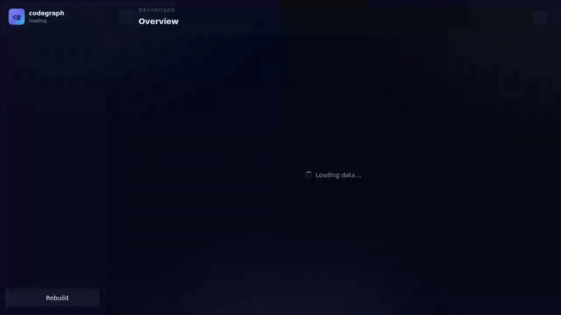
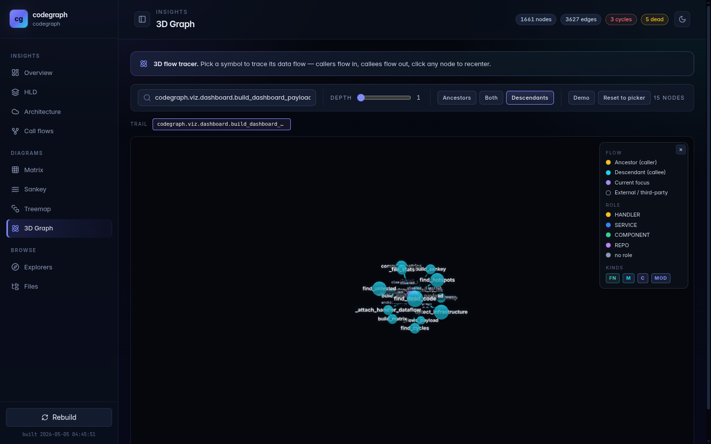
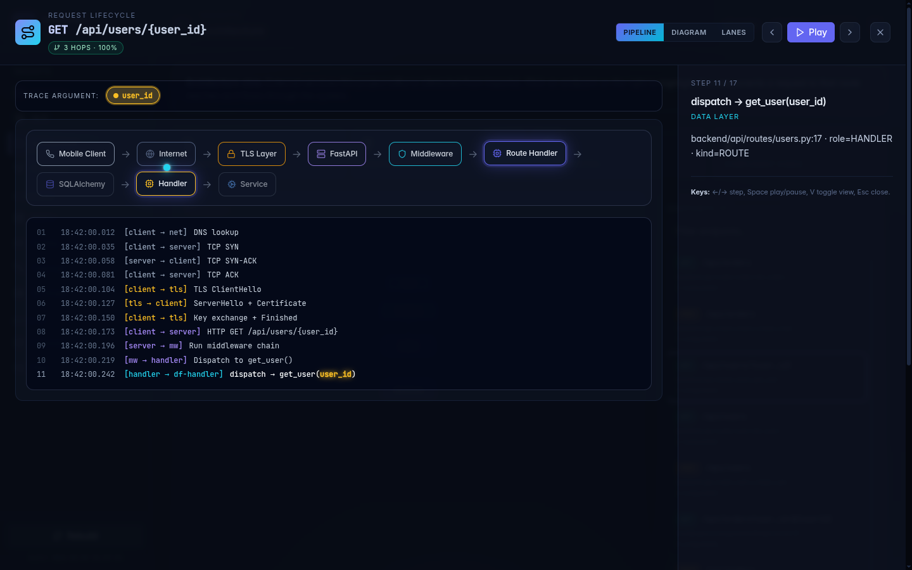
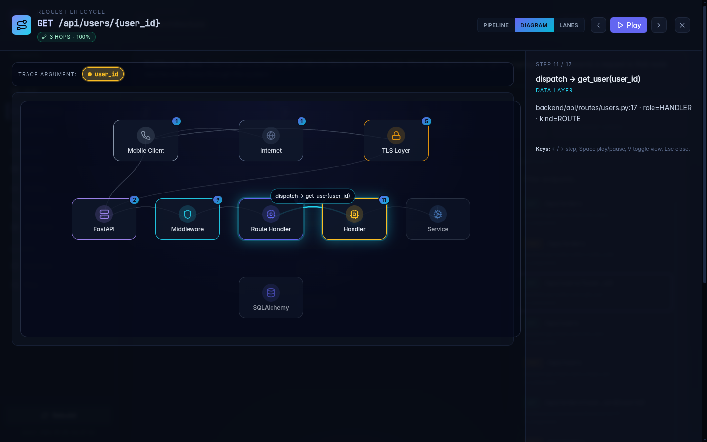

# codegraph

[](https://github.com/smochan/codegraph/actions/workflows/ci.yml)
[](https://www.python.org/downloads/)
[](LICENSE)
[](https://github.com/smochan/codegraph)

> Parse any repo into a queryable code graph. Trace calls, data flow, dead code, and blast radius — without a daemon.

---

## Hero Video



*Watch as a single parameter travels from frontend fetch, through the backend handler and service layers, all the way to the database query — with rename annotations at each hop.*

---

## At a glance

**637 tests · 0 dead code · 3 cycles · 15 MCP tools — all on its own graph.**

```bash
# Install from source
git clone https://github.com/smochan/codegraph.git && cd codegraph
python -m venv .venv && source .venv/bin/activate
pip install -e .

# Build your graph
codegraph init
codegraph build

# Explore locally
codegraph serve          # http://127.0.0.1:8765
codegraph analyze        # dead code, cycles, untested functions
```

---

## The pitch

Pick any function. See what calls it, what it calls, and what data flows through it. Works in your terminal, in a browser, or as an MCP tool inside Claude Code, Cursor, and Windsurf — so your AI assistant reads focused context instead of the entire codebase.

---

## What you get

| Screenshot | Use case |
|:---:|:---|
|  | **3D focus view** — Pick any function and trace its real downstream call tree. Shown: `build_dashboard_payload` (the function that runs every time you `codegraph serve`) with its 15 direct callees — `find_dead_code`, `find_cycles`, `build_hld`, `find_hotspots`, `compute_metrics`, `detect_infrastructure`, and the rest of the analysis stack. Codegraph analyzing itself. |
|  | **Architecture map** — See handlers grouped by role (HANDLER, SERVICE, COMPONENT, REPO), infrastructure components (DB, cache, queue), and their connections at a glance. (codegraph analyzing a sample repo: `GET /api/users/{user_id}` from `examples/cross-stack-demo`) |
|  | **Argument flow trace** — Watch the `user_id` parameter rename and travel through handler → service → repository → SQL query with a timeline visualization. |

---

## Why codegraph

- **Dead code, not false positives.** Recognizes 24 framework decorators (FastAPI, Flask, Celery, pytest, Click, MCP, Django, SQLAlchemy, etc.) so framework-registered handlers are never flagged as unused. We trust codegraph on our own code. Self-reported 451 dead-code findings dropped to 15, then to **0** after PR #21. [See the journey →](docs/images/deadcode_journey.png)

- **See the real architecture.** Functions classified as HANDLER, SERVICE, COMPONENT, or REPOSITORY so you know what layer you're in without reading docs.

- **Argument-level flow capture.** Every call site's arguments are recorded (text-only, no type inference), so when you trace from frontend to database, you see *which* parameter changed names and where.

- **One SQLite file. No daemon.** Graph lives in `.codegraph/graph.db` alongside your repo. Works offline, committed to git, travels with a branch.

---

## How it works

<picture>
  <source media="(prefers-color-scheme: dark)" srcset="docs/images/architecture-dark.svg">
  
</picture>

```
  ┌─────────────────────────────────────────────────────┐
  │  tree-sitter parsing                                │
  │  (Python, TS/JS, TSX, JSX)                          │
  └─────────────────────────────────────────────────────┘
                        ↓
  ┌─────────────────────────────────────────────────────┐
  │  Cross-file resolution (R1, R2, R3)                 │
  │  ✓ per-name imports  ✓ relative imports             │
  │  ✓ constructor calls ✓ decorators                   │
  │  ✓ self.X.Y chains  ✓ fresh instances               │
  └─────────────────────────────────────────────────────┘
                        ↓
  ┌─────────────────────────────────────────────────────┐
  │  SQLite graph (nodes + edges)                       │
  │  DF0: call-site arguments                           │
  │  DF1: routes (FastAPI, Flask, aiohttp)              │
  │  DF2: fetches (fetch, axios, SWR, useQuery)         │
  │  DF3: URL stitching (/{id} ↔ ${id} ↔ :id)          │
  │  DF4: end-to-end trace (fetch→handler→service→DB)   │
  └─────────────────────────────────────────────────────┘
                   ↙            ↓            ↘
            CLI tools       Web dashboard      MCP server
         (graph, roles,    (3D focus view,  (15 tools for
         cycles, dead      architecture,     Claude Code,
         code, untested)   learn mode)       Cursor, etc.)
```

**Parsing:** tree-sitter walks your files, emits nodes (FILE, CLASS, FUNCTION, IMPORTED_NAME) and edges (CALLS, IMPORTS, DEFINED_IN, INHERITS).

**Resolution:** Recognizes import patterns (per-name, relative, star), follows local definitions across files, tracks decorator stacks, and assigns function roles (HANDLER, SERVICE, COMPONENT, REPO) based on framework patterns.

**Surfaces:** Three layers — CLI for scripts and CI, web dashboard for interactive exploration, MCP server so your AI assistant can ask "what changed?" or "trace this argument" without reading 500 files.

---

## Use with Claude Code, Cursor, Windsurf

Register codegraph as an MCP server:

```bash
# Claude Code
# Add to ~/.claude.json:
{
  "mcpServers": {
    "codegraph": {
      "command": "codegraph",
      "args": ["mcp", "serve", "--db", ".codegraph/graph.db"]
    }
  }
}

# Cursor
# Add to ~/.cursor/mcp.json (or .cursor/mcp.json per workspace):
{
  "mcpServers": {
    "codegraph": {
      "command": "codegraph",
      "args": ["mcp", "serve", "--db", ".codegraph/graph.db"]
    }
  }
}

# Windsurf
# Add to ~/.windsurf/mcp.json:
{
  "mcpServers": {
    "codegraph": {
      "command": "codegraph",
      "args": ["mcp", "serve", "--db", ".codegraph/graph.db"]
    }
  }
}
```

Ask questions like:
> *"Which HANDLER nodes have no test coverage?"*
> *"Show me all the callers of UserService.login with their arguments."*
> *"Trace GET /api/users/{id} from the frontend fetch all the way to the database."*
> *"What's the blast radius of changing this function?"*

All 15 tools return small, focused subgraphs — no context-window flooding.

---

## Live demo

A small FastAPI + SQLAlchemy + React fixture lives in [`examples/cross-stack-demo/`](examples/cross-stack-demo/). Run codegraph on it to see DF0, DF1, DF2, DF1.5, and DF3/DF4 all light up:

```bash
codegraph build --no-incremental --root examples/cross-stack-demo
codegraph dataflow trace "GET /api/users/{user_id}"
```

See the [demo README](examples/cross-stack-demo/README.md) for expected output.

---

## Status & roadmap

| Version | Status | What's included |
|---------|--------|-----------------|
| **0.1.0** | **Pre-release on main** | Parsing (Python, TS/JS), DF0–DF4 tracing, 3D dashboard, Architecture + Learn Mode, decorator-aware dead code, cycles, role classification, 15 MCP tools, PR-review CI. |
| **0.1.2** | Planned | TypeScript R2 resolver patterns (path aliases, fresh-instance binding, decorator edges); CLI HANDLER classification for Typer / Click. |
| **0.3+** | Planned | Type inference (Mypy/Pyright), local embeddings layer (semantic + hybrid search), multi-param arg-flow highlighting, more languages (Rust, Go, C#). |

For full roadmap, see [`.planning/MASTER_PLAN.md`](.planning/MASTER_PLAN.md).

PyPI publish is held until the launch video ships. For now, install from source.

---

---

## Features (complete reference)

| Capability | What it does | Example |
|---|---|---|
| **Parsing** | Walks Python and TypeScript/JavaScript/TSX/JSX repositories via tree-sitter at function/method/class granularity. | `codegraph build` |
| **Single SQLite store** | All graph data lives in `.codegraph/graph.db`. No daemon, no database server, no network. | `git commit .codegraph/` |
| **Cross-file resolution** | Five categories of resolver fixes: per-name imports (`from x import a, b, c`), relative imports, same-file constructors, decorator-call edges, `self.X.Y` chains, fresh-instance methods. | Handles `from pkg import a, b, c` → 3 separate edges. |
| **DF0 call-site arguments** | Captures text of each argument at parse time (no type inference). Powers signature tooltips and edge labels in 3D view. | `func(user_id=42)` → edge label shows `user_id=42`. |
| **Decorator-aware dead code** | Recognizes 24 framework decorators (Typer, FastAPI, Click, Celery, pytest, MCP, Flask, Django, SQLAlchemy, etc.). Framework-registered handlers never flagged as unused. | `@app.get("/x")` → handler not dead code. |
| **Call/import cycles** | Detects strongly-connected components. Reports with full qualnames (not hashes) so you can discuss them. | `a.b → c.d → a.b` reported as cycle. |
| **Hotspots, untested, metrics** | Identifies functions with high fan-in (many callers), no test coverage, and aggregate stats (nodes, edges, densities, avg fan-in/out). | `codegraph analyze` |
| **DF1.5 role classification** | Tags functions and classes as HANDLER (route), SERVICE, COMPONENT, REPO (data access) based on framework patterns. HTTP-framework-aware (FastAPI, Flask, Express, NestJS). | `def login() → HANDLER`, `def get_user() → SERVICE`, `User.query() → REPO`. |
| **DF1 ROUTE edges** | FastAPI `@app.get("/x")`, Flask `@app.route("/z", methods=["POST"])`, aiohttp — all detected. Synthetic `route::METHOD::/path` nodes. Flask multi-method expands to one edge per method. | `@app.get("/users/{id}")` → edge to `route::GET::/users/{id}`. |
| **DF1 SQLAlchemy READS_FROM / WRITES_TO** | `session.query(Model)`, `Model.query.filter(...)`, `session.add(...)`, `session.execute(select\|insert\|update\|delete(Model))` all tracked. Edges resolve to in-repo CLASS nodes; unresolved targets dropped. | `session.query(User)` → edge to `User` class node. |
| **DF2 FETCH_CALL extraction** | Detects `fetch(url)`, `axios.get/post/put/delete/patch(url)`, `useSWR(url)`, `useQuery({queryFn})`, and generic `apiClient.get/post(url)`. Captures method, URL, body-key shape. | `fetch("/api/users/{id}")` → edge to synthetic URL node with metadata. |
| **DF3 URL stitching** | Normalizes route and fetch URLs with placeholder handling (`/{id}` ↔ `${id}` ↔ `:id`) and body-key overlap bonus. | `GET /users/{id}` matched to `fetch("/users/${id}")`. |
| **DF4 end-to-end trace** | `codegraph dataflow trace "GET /api/users/{id}"` walks call graph + DF1/DF2 edges, emits ordered hops (frontend → handler → service → repo → SQL). Per-hop argument-flow mapping shows parameter renames. | Trace shows `user_id` (fetch) → `user_id` (param) → `user` (local) → `id` (DB column). |
| **3D focus-mode dashboard** | Pick any function, expand/collapse ancestors/descendants inline, see signatures on hover, edge labels show call-site args. External calls render as leaves. | Click `UserService.get_by_id`, expand 5 levels, fold back. |
| **Architecture view + Learn Mode** | Detects infra (web framework, ORM, cache, message queue, HTTP clients) and groups with role-classified app layer. Click handler → animated sequence/pipeline diagram of full request lifecycle with explanatory text. | Click `@app.post("/users")` → see TCP → TLS → HTTP → query → response. |
| **MCP server (15 tools)** | `find_symbol`, `callers`, `callees`, `blast_radius`, `subgraph`, `dead_code`, `cycles`, `untested`, `hotspots`, `metrics`, `semantic_search`, `hybrid_search`, `dataflow_routes`, `dataflow_fetches`, `dataflow_trace`. | Ask Claude Code: "Who calls this?" → `callers` tool returns list. |
| **CLI reference** | `init`, `build`, `analyze`, `status`, `serve`, `review`, `query`, `baseline`, `hook`, `viz`, `explore`, `mcp`, `embed`. | `codegraph review --format markdown --fail-on high`. |

---

## CLI subcommands

<details>
<summary><strong>Graph Building</strong></summary>

```bash
codegraph init
# Interactive setup: detect languages, configure ignore globs, optionally register MCP.

codegraph build
# Parse repo with tree-sitter, write/update .codegraph/graph.db.

codegraph status
# Show graph freshness, last build time, drift indicators.
```

</details>

<details>
<summary><strong>Analysis</strong></summary>

```bash
codegraph analyze
# Whole-project audit: dead code (decorator-aware), cycles (with qualnames), 
# untested functions, hotspots (high fan-in), metrics.

codegraph query callers <symbol>
# Reverse-BFS: who calls this symbol? Returns list with argument text.

codegraph query callees <symbol>
# Forward traversal: what does this symbol call? Returns list with call-site arguments.

codegraph query subgraph <symbol>
# Induced subgraph around a symbol (ancestors + descendants).

codegraph query deadcode
# List unreferenced functions/classes. Decorator-aware (FastAPI, pytest, etc.).

codegraph query untested
# Functions with no incoming calls from a test module.

codegraph query cycles
# Import and call strongly-connected components, reported with qualnames.

codegraph query hotspots
# Functions with highest fan-in (most callers). Often bottlenecks.

codegraph query metrics
# Aggregate: node count, edge count, density, avg fan-in/out, cycle count.
```

</details>

<details>
<summary><strong>Visualization</strong></summary>

```bash
codegraph serve
# Launch web dashboard at http://127.0.0.1:8765 (3D focus view, Architecture, Learn Mode).

codegraph viz
# Render graph as Mermaid, interactive HTML, or SVG.

codegraph explore
# Generate static subgraph explorer pages (good for sharing).

codegraph dataflow trace "<METHOD> <path>"
# Walk DF1/DF2/DF3/DF4 to trace endpoint from frontend fetch to database.
# Example: codegraph dataflow trace "GET /api/users/{id}"
```

</details>

<details>
<summary><strong>PR Review & Baselines</strong></summary>

```bash
codegraph review
# Graph-diff current branch vs baseline. Output risk report (CSV or Markdown).
# Fails the check on --fail-on high/critical findings.

codegraph baseline save <name>
# Snapshot current graph as a named baseline (e.g., "main").

codegraph baseline status
# Compare current graph to saved baseline.

codegraph baseline push
# Push baseline to remote store (S3 optional).

codegraph hook install
# Install pre-push git hook that runs codegraph review.

codegraph hook uninstall
# Remove the pre-push hook.
```

</details>

<details>
<summary><strong>MCP & Embeddings</strong></summary>

```bash
codegraph mcp serve
# Start MCP server (stdio transport) for Claude Code, Cursor, Windsurf.
# Exposes 15 tools (find_symbol, callers, dead_code, dataflow_trace, etc.).

codegraph embed
# Chunk repository, embed with nomic-ai/CodeRankEmbed, write .codegraph/embeddings.lance.
# Unlocks semantic_search and hybrid_search MCP tools.
```

</details>

---

## MCP tools (15 total)

| Tool | Input | Output | Use case |
|------|-------|--------|----------|
| `find_symbol(query, role=None)` | Symbol name or partial match; optional role filter (HANDLER, SERVICE, COMPONENT, REPO). | List of matching symbols with location and role. | "Find all HANDLER nodes called `login`." |
| `callers(qualname)` | Function or method qualname. | List of callers with argument text at each call site. | "Who calls UserService.get_by_id?" |
| `callees(qualname)` | Function or method qualname. | List of functions this one calls, with argument text. | "What does the login handler call?" |
| `blast_radius(qualname)` | Function or method qualname. | Transitive closure: all functions reachable from this one. | "If I change this utility, what breaks?" |
| `subgraph(qualname, depth=2)` | Symbol; optional depth (default 2). | Induced subgraph (ancestors + descendants). | "Show me the context around this function." |
| `dead_code(role=None)` | Optional role filter. | List of unreferenced functions/classes. Decorator-aware. | "Any dead code in the SERVICE layer?" |
| `cycles(qualname=None)` | Optional symbol to filter to its connected component. | Strongly-connected components with qualnames and member count. | "Are there any import cycles?" |
| `untested(role=None)` | Optional role filter. | Functions with no test calls. | "Which HANDLERs have zero coverage?" |
| `hotspots(top_n=10)` | Optional limit (default 10). | Functions sorted by fan-in (callers). | "What are the bottlenecks?" |
| `metrics()` | None. | Aggregate: node count, edge count, density, avg fan-in/out, cycle count. | "How complex is this codebase?" |
| `semantic_search(query, k=5)` | Query string; max results. | Code snippets ranked by cosine similarity. Requires `codegraph embed`. | "Find password reset logic." |
| `hybrid_search(query, k=5, role=None, focus_qualname=None)` | Query + optional role + optional rerank focal point. | Snippets ranked by 0.6 · cosine + 0.4 · graph-distance. | "Find auth logic near the login handler." |
| `dataflow_routes()` | None. | List of detected routes: {handler_qualname, method, path, framework}. | "What endpoints does the app expose?" |
| `dataflow_fetches(handler_qualname=None)` | Optional filter by handler. | List of frontend fetches: {caller_qualname, method, url, body_keys}. | "Which handlers are called from the frontend?" |
| `dataflow_trace(method_path)` | Route (e.g., "GET /api/users/{id}"). | Ordered list of hops: entry (route) → handler → service → repo → SQL with per-hop arg-flow mapping. | "Trace user_id from frontend to database." |

**Embeddings:** `semantic_search` and `hybrid_search` require running `codegraph embed` first, which chunks the code and embeds with nomic-ai/CodeRankEmbed (Apache 2.0, ~140 MB). Vectors land in `.codegraph/embeddings.lance`. Everything runs locally — no API keys.

---

## PR review CI (dogfood)

`codegraph` ships its own PR-review workflow as a template. Once activated, every PR runs codegraph on itself, posts the diff, and fails on high-severity findings.

**Activate:**

```bash
gh auth refresh -h github.com -s workflow
cp .github/ci-templates/pr-review.workflow.yml .github/workflows/pr-review.yml
git add .github/workflows/pr-review.yml
git commit -m "ci: activate codegraph PR review"
git push
```

**What it does:**

1. Builds a graph from `origin/main` and saves as baseline.
2. Builds a graph from PR head.
3. Runs `codegraph review --format markdown --fail-on high` against the diff.
4. Posts result as sticky PR comment (replaced on each push).
5. Fails the check if findings exceed `--fail-on` threshold.

**Local dry-run:**

```bash
git fetch origin main
./scripts/test-pr-review-locally.sh
```

---

## Architecture deep-dive

### Resolver stages (R1, R2, R3)

**R1 (Parse-time edge emission):**
- Per-name imports: `from x import a, b, c` → 3 separate IMPORTS edges
- Relative imports: `from ..sibling import func` → resolved path
- Same-file constructor calls: `MyClass()` → CALLS edge to `__init__`

**R2 (Cross-file binding):**
- Follow import targets across file boundaries
- Recognize direct assignments (`x = imported_func`)
- Detect decorator stacks and classify functions by framework (FastAPI, Flask, pytest, etc.)

**R3 (Refinement):**
- Decorator-call edges: `@my_decorator` applied to `def func()` → CALLS edge to decorator
- `self.X.Y` chains: `self.service.get_user()` → CALLS edges through property chain
- Fresh-instance binding: `MyClass().method()` → CALLS edge to both `__init__` and `method`
- Conditional `self.X` assignments: track assignments in `__init__` and match them to later calls

### Data-flow layers (DF0 → DF4)

**DF0 — Call-site arguments** (all layers)
- Text-only capture of each argument at parse time
- Metadata: parameter names, return-type annotations
- No type inference (Mypy integration deferred to v0.3+)
- Powers signature tooltips and edge labels in dashboard

**DF1 — HTTP routes** (Python + TypeScript)
- FastAPI `@app.get("/x")`, `@router.post("/y")`
- Flask `@app.route("/z", methods=["POST", "PUT"])` (expands to one edge per method)
- aiohttp `@routes.get("/x")`
- Synthetic `route::METHOD::/path` nodes
- High-low diagram includes `routes[]` array

**DF1.5 — Role classification** (HTTP frameworks only)
- HANDLER: decorated with framework route decorator
- SERVICE: called by HANDLERs, calls REPO/COMPONENT/external
- COMPONENT: utility, shared service, data transformer
- REPO: database access (SQLAlchemy, Prisma, etc.)
- Currently HTTP-framework-aware; Typer/Click deferred to v0.1.2

**DF2 — Frontend fetches** (TypeScript/JavaScript)
- `fetch(url, init?)`, `axios.get/post/put/delete/patch(url)`, `useSWR(url)`, `useQuery({queryFn})`
- Generic `apiClient.get/post/put/delete(url)` heuristic
- Captures method (GET, POST, etc. from init or method name)
- Captures body shape (top-level keys in object literal or `JSON.stringify(...)`)
- URL handling: literals captured verbatim, template literals preserve `${...}`, dynamic URLs flag `url_kind="dynamic"`
- High-low diagram includes `fetches[]` array with `body_keys` metadata

**DF3 — URL stitching** (`match_route`)
- Normalizes route placeholders: `/{id}` ↔ `${id}` ↔ `:id` ↔ numeric segments
- Body-key overlap bonus: if frontend and backend agree on request shape, match is stronger
- One-to-many case handled gracefully (multiple handlers for same path)

**DF4 — End-to-end trace** (`codegraph dataflow trace`)
- Walks call graph + DF1/DF2 cross-layer edges
- Emits ordered `DataFlow` of hops: entry (fetch or direct call) → handler → service → repo → SQL target
- Per-hop argument-flow mapping: `{starting_key → local_name | null}`
- Snake_case ↔ camelCase ↔ PascalCase normalization so `user_id` = `userId` = `UserId`
- Rename annotations in UI: `(was userId)` when local name differs
- Available as CLI subcommand and `dataflow_trace` MCP tool

### High-level diagram (HLD) payload

`serialize_hld()` surfaces three layers:

| Layer | Nodes | Edges | Metadata |
|-------|-------|-------|----------|
| **Infrastructure** | web framework, ORM, cache, message queue, HTTP clients | imports, instantiations | name, version (inferred) |
| **Application** | HANDLER, SERVICE, COMPONENT, REPO nodes | CALLS within layer | role, qualname, file, line |
| **Data** | HANDLER-to-route, handler-to-FETCH_CALL, repo-to-SQLAlchemy | DF1, DF2, DF1, DF1 cross-layer | method, path, URL, body_keys, hop chain (DF4) |

Learn Mode modal reads this to animate request lifecycle.

---

## Limitations (what it doesn't do yet)

- **Argument-flow propagation across hops** (v0.3). DF0 captures the *text* of each argument, and DF4 emits an ordered list of hops, but the value identity of a single argument (e.g. `user_id`) is not yet fully traced from fetch body → route param → service arg → DB query. Per-hop mapping is shipped; full propagation deferred.
- **Type inference** (Mypy / Pyright integration). DF0 is text-only. v0.3+.
- **Per-language resolver parity** (v0.1.2). Python ships the full set of R1/R2/R3 fixes. TypeScript R2 patterns (path aliases, fresh-instance binding, decorator-call edges) are deferred.
- **Typer CLI symbols are not tagged HANDLER** (v0.1.x). DF1.5 only classifies HTTP framework decorators. CLI-handler classification is a follow-up.
- **Async/await visualization** (v0.4). DF4 walks synchronous call graph only.
- **Error-path branch rendering** (v0.4). Learn Mode shows the happy path.
- **Auth middleware as a distinct phase** (v0.4). Today auth shows up as a regular CALL node.
- **Multi-param simultaneous highlighting** (v0.4). Single param selection enough for the launch demo.
- **Cross-process traces** (v0.4). Can't yet link multiple `.codegraph/graph.db` files.

---

## On the self-graph: from 451 dead-code findings to 0

We ran `codegraph` on its own source as the test case. Dead-code findings dropped from **451 → 24+ → 15 → 0** as we fixed the resolver, added decorator-aware entry-point detection, and marked intentional public-API methods with `# pragma: codegraph-public-api`.

**Current self-graph stats:**
- **3,320 nodes** (files, classes, functions, imports)
- **7,557 edges** (5,245 CALLS, 1,357 DEFINED_IN, 886 IMPORTS, 28 INHERITS, 12 ROUTE, 27 FETCH_CALL, 1 READS_FROM, 1 WRITES_TO)
- **3 cycles** (all documented and accepted — see [`.planning/CYCLES_FOUND.md`](.planning/CYCLES_FOUND.md)):
  - Dashboard UI redraw loop: `hldRenderNav → jumpToQualname → drawFocusGraph` (intentional, bounded, tested)
  - Parser self-recursion: `_visit_nested_defs` (intentional traversal of nested function definitions)
  - MCP `_serve ↔ run` static-resolver false positive (documented, low risk)
- **0 dead-code findings** (with pragma exemptions for public-API methods)
- **637 tests passing** (537 Python pytest + 100 Node tests)

---

## Where it fits

| | **codegraph** | GitNexus | code-review-graph | better-code-review-graph | JudiniLabs / mcp-code-graph | RepoMapper | Graphify |
|---|:-:|:-:|:-:|:-:|:-:|:-:|:-:|
| Local-first, single SQLite, no daemon | ✅ | ✅ | ✅ | ✅ | partial | ✅ | varies |
| MCP-native | ✅ | partial | ❌ | ❌ | ✅ | ❌ | ❌ |
| External calls stop at boundary | ✅ | ❌ | ❌ | ❌ | ❌ | ❌ | ❌ |
| Decorator-aware dead code (24 frameworks) | ✅ | ❌ | ❌ | ❌ | ❌ | ❌ | ❌ |
| Role classification (HANDLER/SERVICE/...) | ✅ | ❌ | ❌ | ❌ | ❌ | ❌ | ❌ |
| Argument-level data flow text capture (DF0) | ✅ | ❌ | ❌ | ❌ | ❌ | ❌ | ❌ |
| 3D focus-mode flow tracer | ✅ | ✅ | ❌ | ❌ | ❌ | ❌ | partial |
| Cycles reported with qualnames | ✅ | partial | ❌ | ❌ | ❌ | ❌ | ❌ |
| Open source, MIT | ✅ | ✅ | ✅ | ✅ | ✅ | ✅ | varies |

**Languages:** Python and TypeScript / JavaScript / TSX / JSX. Go, Java, Rust, C#, Ruby, PHP are roadmap items — adding each is a single-file tree-sitter mapping.

**Wedge:** codegraph wins on external-call boundaries (your code stays in focus), decorator-aware dead-code detection, role classification, 3D focus-mode flow tracing, and (in v0.2+) cross-stack data-flow tracing with argument capture. Embedding-based retrieval tools (Cursor, Cody, code-review-graph) handle prose/docstrings better — the right architecture is **graph + embeddings in the same MCP loop**. v0.3 adds a local embeddings layer so codegraph can offer hybrid retrieval without API keys.

---

## Prior art and related projects

`codegraph` was built independently. It is **not a fork** of, and does not descend from, any other code-graph project.

Other projects in the local code-graph / MCP-for-AI space worth knowing about:

- **[code-review-graph](https://github.com/tirth8205/code-review-graph)** — token-efficient review context with embeddings, the template for many tools in this space.
- **[better-code-review-graph](https://github.com/n24q02m/better-code-review-graph)** — fork with polish and additional features.
- **GitNexus** — visualization polish, broader graph.
- **[JudiniLabs/mcp-code-graph](https://github.com/JudiniLabs/mcp-code-graph)** — MCP-native code graph.

**Why codegraph is different:** decorator-aware dead-code detection (24 frameworks), role classification (HANDLER/SERVICE/COMPONENT/REPO), a 3D focus-mode flow tracer, and (in v0.2+) cross-stack data-flow tracing with argument capture at each call site. We don't compete on embedding-based retrieval — that's not our wedge.

---

## Development

New to the repo? Start with [`docs/GETTING_STARTED.md`](docs/GETTING_STARTED.md).

```bash
python -m venv .venv && source .venv/bin/activate
pip install -e ".[dev]"

ruff check .                    # lint
mypy --strict codegraph         # type-check
pytest -q                       # 537 Python tests
node --test tests/*.js          # 100 Node tests
```

All CI checks are defined in `.github/workflows/ci.yml`. Run locally before pushing:

```bash
./scripts/test-pr-review-locally.sh    # dry-run the PR review workflow
```

---

## Acknowledgements

`codegraph` stands on:
[tree-sitter](https://tree-sitter.github.io/) (parsing),
[vasturiano/3d-force-graph](https://github.com/vasturiano/3d-force-graph) (3D rendering),
[networkx](https://networkx.org/) (graph algorithms),
[pydantic](https://docs.pydantic.dev/) (typed schema),
[typer](https://typer.tiangolo.com/) (CLI),
[rich](https://rich.readthedocs.io/) (console output), and the
[Model Context Protocol Python SDK](https://modelcontextprotocol.io/).

---

## Contributing

See [`CONTRIBUTING.md`](CONTRIBUTING.md) for local setup, CI checks, commit conventions, and PR merge process. Always run `./scripts/test-pr-review-locally.sh` before opening a PR.

---

## License

[MIT](LICENSE) © mochan
