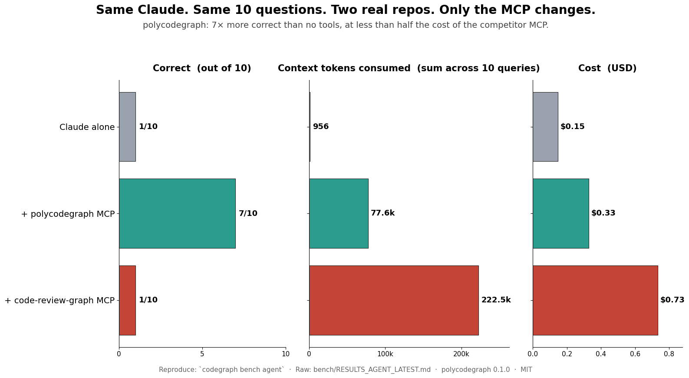
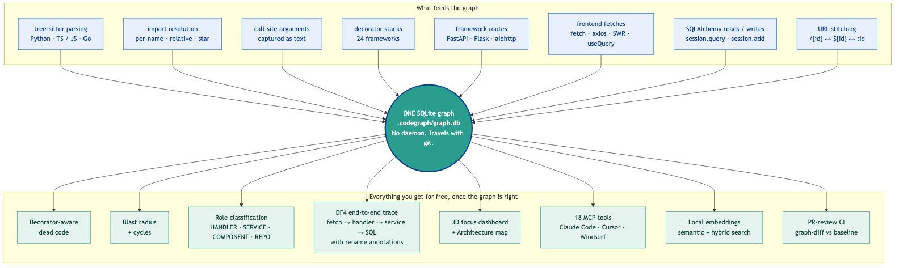
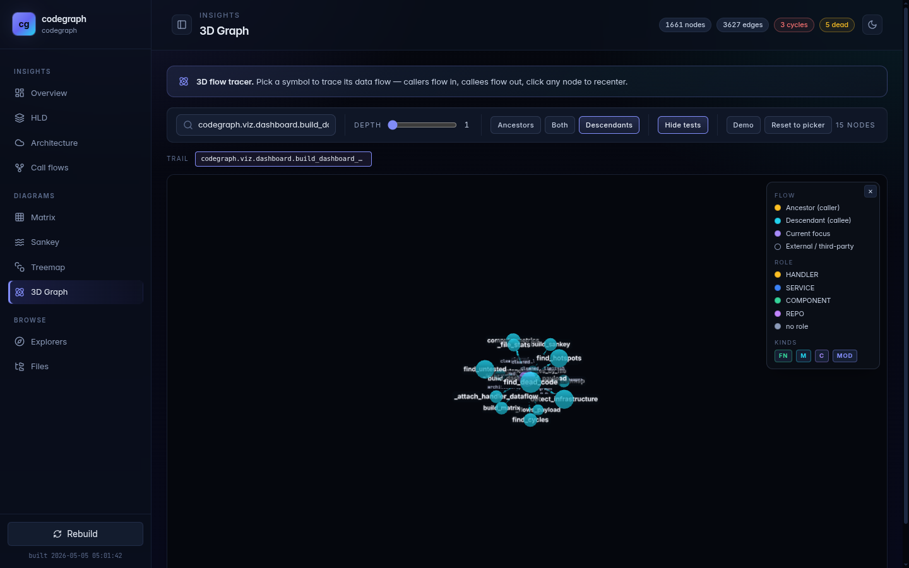
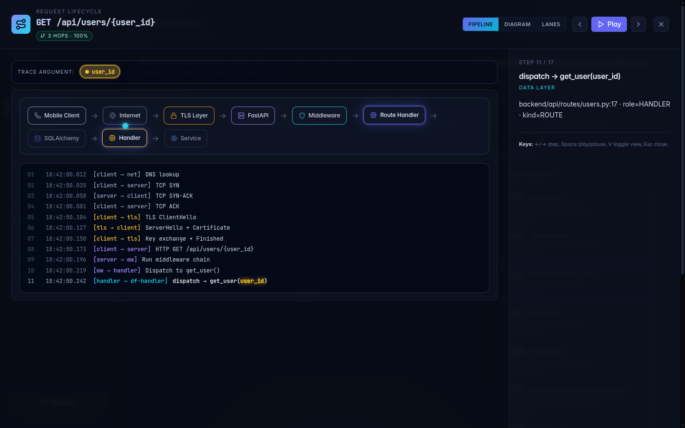
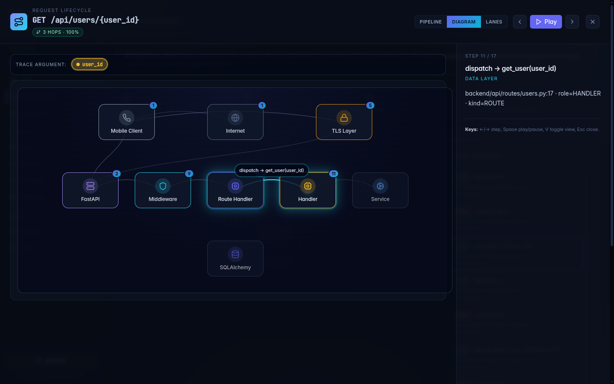

# polycodegraph

[](https://github.com/smochan/polycodegraph/actions/workflows/ci.yml)
[](https://pypi.org/project/polycodegraph/)
[](https://www.python.org/downloads/)
[](LICENSE)
[](#mcp-tools-18-total)

> Parse any repo into a queryable code graph. Trace one parameter from a frontend fetch through every layer to the SQL query. Powers Claude Code, Cursor, and Windsurf via MCP — so your AI assistant reads focused context instead of the entire codebase.



*Same Claude Sonnet 4.6. Same 10 questions about two real repos (codegraph itself + FastAPI). Only the registered MCP server changes. Reproduce with `codegraph bench agent`, raw data in [`bench/RESULTS_AGENT_LATEST.md`](bench/RESULTS_AGENT_LATEST.md).*

---

## Quick start

```bash
pip install polycodegraph
codegraph init       # detect languages, configure MCP
codegraph build      # parse repo → .codegraph/graph.db
codegraph serve      # web dashboard at http://127.0.0.1:8765
```

That's it. Three commands and you have a queryable graph, a 3D dashboard, and an MCP server your IDE can talk to.

---

## The MOAT — one graph, everything on top

polycodegraph has exactly one opinion: **build the right graph, and every interesting feature falls out for free.**

The inputs that feed the graph go beyond imports and call edges. polycodegraph reads tree-sitter parses for **Python, TypeScript, JavaScript, and Go**; captures **every call-site's arguments as text**; recognizes **24 framework decorators** so FastAPI / Flask / Celery / pytest / Click / MCP / Django / SQLAlchemy handlers are never confused with dead code; detects **routes** (`@app.get("/x")`) and **frontend fetches** (`fetch`, `axios`, `useSWR`, `useQuery`); and **stitches URLs across the stack** (`/{id} ↔ ${id} ↔ :id`) so it can trace a fetch all the way to its handler.

The outputs that come *for free* once the graph is right:



Decorator-aware dead code, role classification (HANDLER / SERVICE / COMPONENT / REPO), blast radius, cycles, untested-function detection, an end-to-end cross-stack trace with rename annotations, a 3D focus-mode dashboard, a Learn Mode lifecycle modal, local embeddings for semantic + hybrid search, an 18-tool MCP server, and a PR-review CI that graph-diffs the branch against `main`.

One SQLite file. No daemon. No network. Travels with your git branch.

---

## How it works

```text
  ┌─────────────────────────────────────────────────────┐
  │  tree-sitter parsing                                │
  │  (Python, TS/JS, TSX, JSX, Go)                      │
  └─────────────────────────────────────────────────────┘
                        ↓
  ┌─────────────────────────────────────────────────────┐
  │  Cross-file resolution (R1, R2, R3)                 │
  │  ✓ per-name imports  ✓ relative imports             │
  │  ✓ constructor calls ✓ decorators                   │
  │  ✓ self.X.Y chains  ✓ fresh instances               │
  └─────────────────────────────────────────────────────┘
                        ↓
  ┌─────────────────────────────────────────────────────┐
  │  SQLite graph (nodes + edges)                       │
  │  DF0: call-site arguments                           │
  │  DF1: routes (FastAPI, Flask, aiohttp)              │
  │  DF2: fetches (fetch, axios, SWR, useQuery)         │
  │  DF3: URL stitching (/{id} ↔ ${id} ↔ :id)          │
  │  DF4: end-to-end trace (fetch→handler→service→DB)   │
  └─────────────────────────────────────────────────────┘
                   ↙            ↓            ↘
            CLI tools       Web dashboard      MCP server
         (graph, roles,    (3D focus view,  (18 tools for
         cycles, dead      architecture,     Claude Code,
         code, untested)   learn mode)       Cursor, etc.)
```

---

## What you can do

| Screenshot | Use case |
|:---:|:---|
|  | **3D focus view** — Pick any function, trace its real downstream call tree, expand or collapse ancestors and descendants inline. Shown: `build_dashboard_payload` with its 15 direct callees — `find_dead_code`, `find_cycles`, `build_hld`, `find_hotspots`, `compute_metrics`, and the rest of the analysis stack. |
|  | **Architecture map** — Handlers grouped by role (HANDLER, SERVICE, COMPONENT, REPO), infrastructure components (DB, cache, queue), and their connections at a glance. Click a handler → Learn Mode opens a request-lifecycle modal: TCP → TLS → HTTP → query → response. |
|  | **DF4 cross-stack trace** — `codegraph dataflow trace "GET /api/users/{user_id}"` walks the graph from a frontend fetch through the handler, service, and repository to the SQL query, with **rename annotations at every hop** (`userId → user_id → id`). |
| _coming soon_ | **MCP tools in Claude Code** — Ask Claude *"trace `Depends` through FastAPI"* and watch it call `dataflow_trace` instead of grepping. Each tool returns a small focused subgraph (~20-50 tokens) so context windows stay clean. |

---

## Benchmark — same Claude, varying MCP

Three configurations. Same Claude Sonnet 4.6. Same 10 questions across two real codebases (polycodegraph itself + FastAPI). Only the registered MCP server changes.

### codegraph-self

| Configuration | Correct | Avg tool-calls | Tokens in | Cost (USD) |
|---|---:|----:|----:|----:|
| `baseline` (Claude alone) | 0 / 5 | 0 | 480 | $0.07 |
| `+ code-review-graph` MCP | 0 / 5 | 3 | 144,422 | $0.47 |
| `+ polycodegraph` MCP | **4 / 5** | 1.4 | 36,639 | $0.15 |

### fastapi

| Configuration | Correct | Avg tool-calls | Tokens in | Cost (USD) |
|---|---:|----:|----:|----:|
| `baseline` (Claude alone) | 1 / 5 | 0 | 476 | $0.08 |
| `+ code-review-graph` MCP | 1 / 5 | 1.3 | 78,069 | $0.26 |
| `+ polycodegraph` MCP | **3 / 5** | 1.6 | 40,953 | $0.18 |

Same model, same questions: **polycodegraph is 7× more correct than Claude with no tools, and 7× more correct than the competitor MCP at less than half the cost.** Code-review-graph's 30 verbose tool schemas pre-burn ~30k tokens of context before the first useful call.

Reproduce: `codegraph bench agent --only baseline,polycodegraph,code-review-graph`. Raw per-run JSONL in [`bench/agent_raw_latest.jsonl`](bench/agent_raw_latest.jsonl). Full methodology in [`bench/README.md`](bench/README.md).

---

## Install & use

### From PyPI

```bash
pip install polycodegraph
codegraph init
codegraph build
```

### Register as an MCP server

```jsonc
// Claude Code  →  ~/.claude.json
{
  "mcpServers": {
    "codegraph": {
      "command": "codegraph",
      "args": ["mcp", "serve"]
    }
  }
}

// Cursor  →  ~/.cursor/mcp.json  (or .cursor/mcp.json per workspace)
{ "mcpServers": { "codegraph": { "command": "codegraph", "args": ["mcp", "serve"] } } }

// Windsurf  →  ~/.windsurf/mcp.json
{ "mcpServers": { "codegraph": { "command": "codegraph", "args": ["mcp", "serve"] } } }
```

Then ask your assistant questions like:

> *"Which HANDLER nodes have no test coverage?"*
> *"Show me all the callers of `UserService.login` with their arguments."*
> *"Trace `GET /api/users/{id}` from the frontend fetch all the way to the database."*
> *"What's the blast radius of changing this function?"*

All 18 tools return small, focused subgraphs — no context-window flooding.

### Optional: local embeddings

```bash
pip install 'polycodegraph[embed]'
codegraph embed     # chunks the repo, embeds with nomic-ai/CodeRankEmbed
```

Unlocks the `semantic_search` and `hybrid_search` MCP tools. ~140 MB model download, runs locally, no API keys.

---

## Live demo

A small FastAPI + SQLAlchemy + React fixture lives in [`examples/cross-stack-demo/`](examples/cross-stack-demo/). Run polycodegraph on it to see DF0, DF1, DF1.5, DF2, DF3, and DF4 all light up:

```bash
codegraph build --no-incremental --root examples/cross-stack-demo
codegraph dataflow trace "GET /api/users/{user_id}"
```

See the [demo README](examples/cross-stack-demo/README.md) for expected output.

---

## Limitations (honest list)

What polycodegraph *doesn't* do yet. Listed here so the benchmark and README claims stay clean.

- **Type inference** (Mypy / Pyright). DF0 captures argument *text*, not types. Roadmap v0.3.
- **Argument-value identity across hops.** DF4 emits ordered hops with rename annotations; full single-value propagation from fetch body → route param → service arg → DB column is deferred (v0.3).
- **Docstrings are stored on every node but not yet consumed by analysis.** Embeddings use them as fallback body text; dead-code, role classification, and dataflow ignore them. Roadmap v0.3.
- **Git-history mining** (commit-message semantics, author / touch-frequency signals). Not implemented. Git is used only for the current HEAD SHA and PR-review diff. Roadmap v0.4.
- **Per-language resolver parity** (v0.1.2). Python ships the full R1/R2/R3 fixes. TypeScript R2 patterns (path aliases, fresh-instance binding, decorator-call edges) are deferred.
- **Typer CLI symbols are not tagged HANDLER** (v0.1.x). DF1.5 only classifies HTTP framework decorators.
- **Async / await visualization** (v0.4). DF4 walks the synchronous call graph only.
- **Error-path branch rendering** (v0.4). Learn Mode shows the happy path.
- **Auth middleware as a distinct phase** (v0.4). Today auth shows up as a regular CALL node.
- **Multi-param simultaneous highlighting** (v0.4). Single-param selection only.
- **Cross-process traces** (v0.4). Can't yet link multiple `.codegraph/graph.db` files.

---

## Roadmap

| Version | Status | What's in / what's planned |
|---|---|---|
| **0.1.0** | **Shipping on PyPI today** | Parsing (Python, TS/JS, Go), DF0–DF4 tracing, 3D dashboard + Architecture + Learn Mode, decorator-aware dead code, cycles, role classification, **local embeddings** (semantic + hybrid search), 18 MCP tools, PR-review CI, cross-repo workspace mode. |
| 0.1.2 | Planned | TypeScript R2 resolver patterns (path aliases, fresh-instance binding, decorator edges); CLI HANDLER classification for Typer / Click. |
| 0.3 | Planned | Type inference (Mypy/Pyright); full single-value arg-flow propagation; docstring-driven analysis hints; multi-param highlighting; more languages (Rust, Java, C#). |
| 0.4 | Planned | Async / await visualization; error-path branches; auth-middleware phase; cross-process traces; git-history semantics. |

---

## On the self-graph: from 451 dead-code findings to 0

We run polycodegraph on its own source as a regression target. Dead-code findings dropped from **451 → 24+ → 15 → 0** as the resolver hardened, decorator-aware entry-point detection landed, and intentional public-API methods were marked with `# pragma: codegraph-public-api`.

Current self-graph stats:

- **3,320 nodes** (files, classes, functions, imports)
- **7,557 edges** (5,245 CALLS, 1,357 DEFINED_IN, 886 IMPORTS, 28 INHERITS, 12 ROUTE, 27 FETCH_CALL, 1 READS_FROM, 1 WRITES_TO)
- **3 cycles**, all documented and accepted (dashboard redraw, parser self-recursion, MCP serve/run resolver false positive)
- **0 dead-code findings** (with pragma exemptions for public-API methods)
- **637 tests passing** (537 Python pytest + 100 Node tests)

---

## Where it fits

| | **polycodegraph** | GitNexus | code-review-graph | better-code-review-graph | JudiniLabs / mcp-code-graph | RepoMapper | Graphify |
|---|:-:|:-:|:-:|:-:|:-:|:-:|:-:|
| Local-first, single SQLite, no daemon | ✅ | ✅ | ✅ | ✅ | partial | ✅ | varies |
| MCP-native (stdio) | ✅ | ✅ | ✅ | ✅ | ✅ | ❌ | ✅ |
| Cross-stack end-to-end trace (fetch → SQL) | ✅ | ❌ | ❌ | ❌ | ❌ | ❌ | ❌ |
| Decorator-aware dead code (24 frameworks) | ✅ | ❌ | ❌ | ❌ | ❌ | ❌ | ❌ |
| Role classification (HANDLER/SERVICE/...) | ✅ | ❌ | ❌ | ❌ | ❌ | ❌ | ❌ |
| Argument-level data flow text capture (DF0) | ✅ | ❌ | ❌ | ❌ | ❌ | ❌ | ❌ |
| 3D focus-mode flow tracer | ✅ | ✅ | ❌ | ❌ | ❌ | ❌ | partial |
| Local embeddings (no API key) | ✅ | ❌ | ✅ | ✅ | ❌ | ❌ | ❌ |
| Open source, MIT | ✅ | ❌ (PolyForm NC) | ✅ | ✅ | ✅ | ✅ | varies |

The wedge isn't a fancier graph algorithm — it's that polycodegraph treats *trace this argument across the stack* as a first-class operation, not a follow-up grep. Embedding-based retrieval tools (code-review-graph, Cursor, Cody) handle prose / docstrings well; the right architecture is **graph + embeddings in the same MCP loop**, and v0.1.0 ships both.

---

<details>
<summary><strong>Full feature reference (16 capabilities)</strong></summary>

| Capability | What it does | Example |
|---|---|---|
| **Parsing** | tree-sitter walks Python / TypeScript / JavaScript / TSX / JSX / Go at function/method/class granularity. | `codegraph build` |
| **Single SQLite store** | All graph data in `.codegraph/graph.db`. No daemon, no DB server, no network. | `git commit .codegraph/` |
| **Cross-file resolution** | Per-name imports, relative imports, same-file constructors, decorator-call edges, `self.X.Y` chains, fresh-instance methods. | `from pkg import a, b, c` → 3 separate edges |
| **DF0 call-site arguments** | Captures the text of each argument at parse time (no type inference). Powers signature tooltips and edge labels. | `func(user_id=42)` → edge label shows `user_id=42` |
| **Decorator-aware dead code** | 24 framework decorators recognized (Typer, FastAPI, Click, Celery, pytest, MCP, Flask, Django, SQLAlchemy, etc.). Framework-registered handlers never flagged. | `@app.get("/x")` → handler not dead code |
| **Call/import cycles** | Detects strongly-connected components, reports with full qualnames. | `a.b → c.d → a.b` |
| **Hotspots, untested, metrics** | High-fan-in detection, untested-function listing, aggregate graph metrics. | `codegraph analyze` |
| **DF1.5 role classification** | Functions tagged HANDLER / SERVICE / COMPONENT / REPO from framework patterns. FastAPI / Flask / Express / NestJS aware. | `def login() → HANDLER` |
| **DF1 ROUTE edges** | FastAPI, Flask (multi-method expansion), aiohttp. Synthetic `route::METHOD::/path` nodes. | `@app.get("/users/{id}")` → edge to `route::GET::/users/{id}` |
| **DF1 SQLAlchemy READS_FROM / WRITES_TO** | `session.query`, `Model.query.filter`, `session.add`, `session.execute(select\|insert\|update\|delete(Model))`. | `session.query(User)` → edge to `User` class |
| **DF2 FETCH_CALL extraction** | `fetch`, `axios.get/post/...`, `useSWR`, `useQuery`, generic `apiClient.get/post`. Captures method, URL, body-key shape. | `fetch("/api/users/{id}")` → URL node with metadata |
| **DF3 URL stitching** | Placeholder normalization (`/{id}` ↔ `${id}` ↔ `:id`); body-key overlap bonus; one-to-many tolerated. | `GET /users/{id}` ↔ `fetch("/users/${id}")` |
| **DF4 end-to-end trace** | CLI + MCP tool. Walks call graph + DF1/DF2 edges, emits ordered hops with per-hop arg-flow mapping. | Trace shows `user_id` (fetch) → `user_id` (param) → `user` (local) → `id` (DB column) |
| **3D focus-mode dashboard** | Pick any function, expand/collapse ancestors/descendants inline, signatures on hover, edge labels show call-site args. | Click `UserService.get_by_id`, expand 5 levels |
| **Architecture view + Learn Mode** | Detects infra (framework, ORM, cache, queue, HTTP clients). Click handler → animated TCP → TLS → HTTP → query → response lifecycle. | Click `@app.post("/users")` |
| **Local embeddings** | `codegraph embed` chunks the repo, embeds with nomic-ai/CodeRankEmbed (Apache 2.0, ~140 MB), enables `semantic_search` and `hybrid_search`. | `codegraph embed` |
| **MCP server (18 tools)** | All graph queries exposed via stdio MCP — works with Claude Code, Cursor, Windsurf out of the box. | `codegraph mcp serve` |
| **PR-review CI** | `codegraph review --format markdown --fail-on high` graph-diffs the branch vs baseline. | `cp .github/ci-templates/pr-review.workflow.yml .github/workflows/` |

</details>

<details>
<summary><strong>CLI subcommands</strong></summary>

```bash
# Graph building
codegraph init      # interactive setup: detect languages, configure ignore globs, register MCP
codegraph build     # parse repo with tree-sitter, write/update .codegraph/graph.db
codegraph status    # graph freshness, last build time, drift indicators

# Analysis
codegraph analyze                # whole-project audit: dead code, cycles, untested, hotspots, metrics
codegraph query callers <symbol> # reverse-BFS: who calls this?
codegraph query callees <symbol> # forward traversal: what does this call?
codegraph query subgraph <symbol>
codegraph query deadcode
codegraph query untested
codegraph query cycles
codegraph query hotspots
codegraph query metrics

# Visualization
codegraph serve                       # web dashboard at http://127.0.0.1:8765
codegraph viz                         # Mermaid / interactive HTML / SVG
codegraph explore                     # static subgraph explorer pages (good for sharing)
codegraph dataflow trace "<M> <path>" # walk DF1→DF4 to trace endpoint frontend→DB

# PR review + baselines
codegraph review              # graph-diff current branch vs baseline; CSV or Markdown
codegraph baseline save       # snapshot current graph as the local baseline
codegraph baseline status
codegraph baseline push       # optional S3 remote
codegraph hook install        # pre-push git hook running codegraph review
codegraph hook uninstall

# MCP + embeddings
codegraph mcp serve           # MCP stdio server: 18 tools for Claude Code / Cursor / Windsurf
codegraph embed               # chunk + embed (nomic-ai/CodeRankEmbed); enables semantic + hybrid search

# Cross-repo workspace mode
codegraph workspace init      # ~/.codegraph/workspace.yml
codegraph workspace add <path>
codegraph workspace remove <path>
codegraph workspace list
codegraph workspace status
codegraph workspace sync [--only <name>]
```

</details>

<details>
<summary><strong>MCP tools (18 total)</strong></summary>

| Tool | Input | Output | Use case |
|------|-------|--------|----------|
| `find_symbol(query, role=None)` | Symbol name or partial match; optional role filter. | Matching symbols + location + role. | "Find all HANDLERs called `login`." |
| `callers(qualname)` | Function qualname. | Callers with argument text at each call site. | "Who calls `UserService.get_by_id`?" |
| `callees(qualname)` | Function qualname. | Functions this one calls with argument text. | "What does the login handler call?" |
| `blast_radius(qualname)` | Function qualname. | Transitive closure of all reachable functions. | "If I change this utility, what breaks?" |
| `subgraph(qualname, depth=2)` | Symbol + optional depth. | Induced subgraph (ancestors + descendants). | "Show me the context around this function." |
| `dead_code(role=None)` | Optional role filter. | Unreferenced functions/classes. Decorator-aware. | "Any dead code in the SERVICE layer?" |
| `cycles(qualname=None)` | Optional symbol filter. | SCCs with qualnames and member count. | "Are there any import cycles?" |
| `untested(role=None)` | Optional role filter. | Functions with no test calls. | "Which HANDLERs have zero coverage?" |
| `hotspots(top_n=10)` | Optional limit. | Functions sorted by fan-in. | "What are the bottlenecks?" |
| `metrics()` | None. | Node/edge counts, density, fan-in/out, cycles. | "How complex is this codebase?" |
| `semantic_search(query, k=5)` | Query string + max results. | Snippets ranked by cosine similarity. Requires `codegraph embed`. | "Find password reset logic." |
| `hybrid_search(query, k=5, role=None, focus_qualname=None)` | Query + optional role + rerank focal point. | Snippets ranked by 0.6 · cosine + 0.4 · graph-distance. | "Find auth logic near the login handler." |
| `dataflow_routes()` | None. | Detected routes: handler, method, path, framework. | "What endpoints does the app expose?" |
| `dataflow_fetches(handler_qualname=None)` | Optional handler filter. | Frontend fetches: caller, method, URL, body keys. | "Which handlers are called from the frontend?" |
| `dataflow_trace(method_path)` | Route (e.g. `"GET /api/users/{id}"`). | Ordered hops: route → handler → service → repo → SQL with per-hop arg-flow. | "Trace `user_id` from frontend to database." |
| `workspace_state()` | None. | Per-repo: branch, dirty count, last commit, graph presence. | "What's the state of every repo I'm working on?" |
| `workspace_diff_since(ref="main")` | Optional ref. | Per-repo files changed since ref. | "What did I touch this week across all my repos?" |
| `workspace_blast_radius(symbol, depth=None)` | Symbol + optional depth. | Per-repo blast radius unioned across the workspace. | "If I rename this function, what breaks across all my projects?" |

</details>

<details>
<summary><strong>Architecture deep-dive (R1/R2/R3 resolver stages + DF0–DF4 implementation)</strong></summary>

### Resolver stages

**R1 (Parse-time edge emission):**
- Per-name imports: `from x import a, b, c` → 3 separate IMPORTS edges
- Relative imports: `from ..sibling import func` → resolved path
- Same-file constructor calls: `MyClass()` → CALLS edge to `__init__`

**R2 (Cross-file binding):**
- Follow import targets across file boundaries
- Recognize direct assignments (`x = imported_func`)
- Detect decorator stacks and classify functions by framework

**R3 (Refinement):**
- Decorator-call edges: `@my_decorator` applied to `def func()` → CALLS edge to decorator
- `self.X.Y` chains: `self.service.get_user()` → CALLS edges through property chain
- Fresh-instance binding: `MyClass().method()` → CALLS edge to both `__init__` and `method`
- Conditional `self.X` assignments tracked from `__init__`

### Data-flow layers

**DF0 — Call-site arguments** — text capture at parse time, no type inference. Powers signature tooltips + edge labels.

**DF1 — HTTP routes** — FastAPI / Flask / aiohttp. Synthetic `route::METHOD::/path` nodes.

**DF1.5 — Role classification** — HANDLER (route-decorated), SERVICE (called by HANDLERs), COMPONENT (utility), REPO (DB access).

**DF2 — Frontend fetches** — `fetch`, `axios.*`, `useSWR`, `useQuery`, generic `apiClient.*`. Captures method, URL, body-key shape.

**DF3 — URL stitching** — placeholder normalization, body-key overlap bonus, one-to-many tolerated.

**DF4 — End-to-end trace** — walks call graph + DF1/DF2 cross-layer edges, emits ordered hops with per-hop arg-flow mapping. Snake_case ↔ camelCase ↔ PascalCase normalization so `user_id` = `userId` = `UserId`. Rename annotations: `(was userId)` when local name differs.

### HLD payload

`serialize_hld()` surfaces three layers — **Infrastructure** (framework / ORM / cache / queue / HTTP clients), **Application** (HANDLER / SERVICE / COMPONENT / REPO nodes), **Data** (HANDLER-to-route, handler-to-FETCH_CALL, repo-to-SQLAlchemy with DF4 hop chains). Learn Mode reads this to animate request lifecycles.

</details>

<details>
<summary><strong>PR review CI (dogfood)</strong></summary>

polycodegraph ships its own PR-review workflow as a template. Once activated, every PR runs polycodegraph on itself, posts the diff, and fails on high-severity findings.

**Activate:**
```bash
gh auth refresh -h github.com -s workflow
cp .github/ci-templates/pr-review.workflow.yml .github/workflows/pr-review.yml
git add .github/workflows/pr-review.yml
git commit -m "ci: activate codegraph PR review"
git push
```

**What it does:** builds a baseline graph from `origin/main`, builds a head graph from the PR, runs `codegraph review --format markdown --fail-on high`, posts the result as a sticky PR comment.

**Local dry-run:**
```bash
./scripts/test-pr-review-locally.sh
```

</details>

---

## Development

```bash
python -m venv .venv && source .venv/bin/activate
pip install -e ".[dev]"

ruff check .                    # lint
mypy --strict codegraph         # type-check
pytest -q                       # 537 Python tests
node --test tests/*.js          # 100 Node tests
./scripts/test-pr-review-locally.sh  # dry-run the PR review workflow
```

CI checks are defined in `.github/workflows/ci.yml`. New to the repo? Start with [`docs/GETTING_STARTED.md`](docs/GETTING_STARTED.md). For commit conventions and PR process, see [`CONTRIBUTING.md`](CONTRIBUTING.md).

---

## Acknowledgements

polycodegraph stands on
[tree-sitter](https://tree-sitter.github.io/) (parsing),
[vasturiano/3d-force-graph](https://github.com/vasturiano/3d-force-graph) (3D rendering),
[networkx](https://networkx.org/) (graph algorithms),
[pydantic](https://docs.pydantic.dev/) (typed schema),
[typer](https://typer.tiangolo.com/) (CLI),
[rich](https://rich.readthedocs.io/) (console output),
[nomic-ai/CodeRankEmbed](https://huggingface.co/nomic-ai/CodeRankEmbed) (embeddings),
and the [Model Context Protocol Python SDK](https://modelcontextprotocol.io/).

---

## License

[MIT](LICENSE) © mochan

Commercial support, deployments, and custom-licensed forks available — contact smochan07@gmail.com. polycodegraph itself is and stays MIT; the contact line exists for teams who want enterprise support or specific license arrangements on top.

Pull requests welcome. See [`CONTRIBUTING.md`](CONTRIBUTING.md) for local setup, CI checks, commit conventions, and the one-click [Contributor License Agreement](CLA.md) you'll be asked to sign on your first PR.
